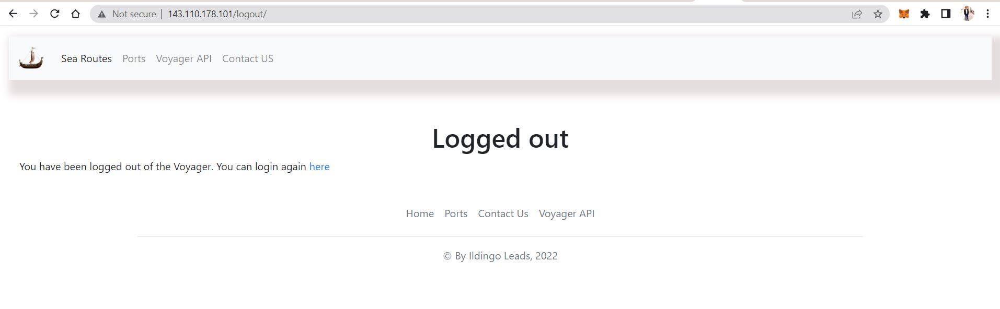
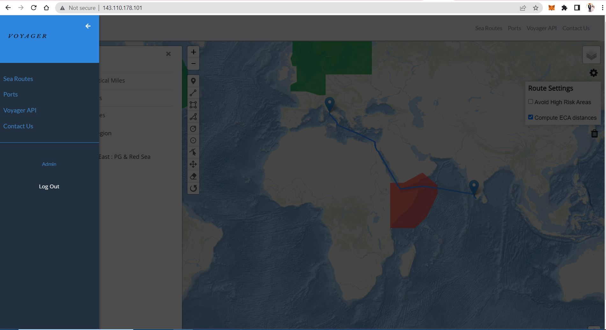
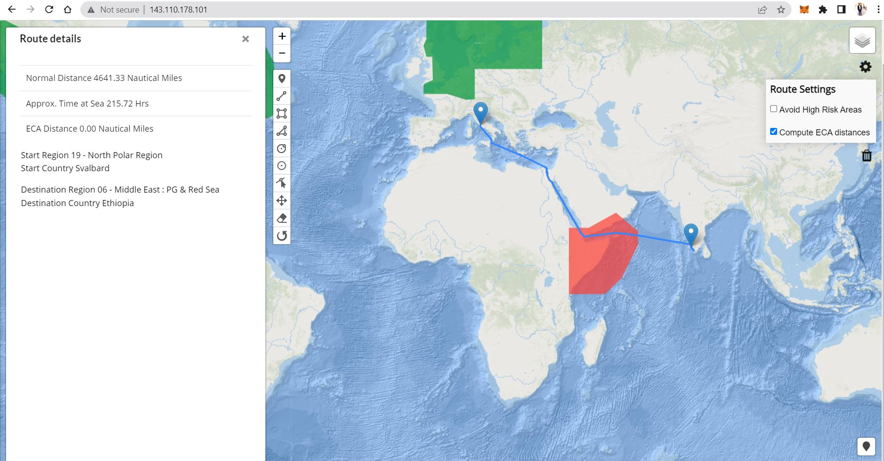
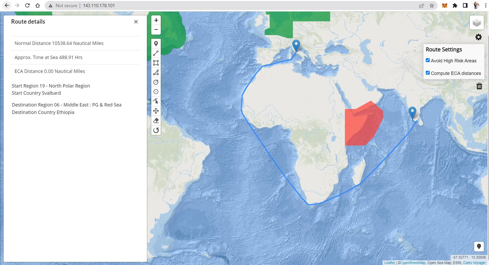

# Port to Port Sea Routing 
Using open source tools such as PostgreSQL, PostGIS, GeoServer, Django Framework and LeafletJS, the web GIS application enables a user to find sea routes between ports in the ocean and major seas. The shortest-path queries have also been optimized to avoid obstacles such as High Risk Areas and ECA areas while at sea.

# Objective
1. Developing a spatial database to use for computaions of shortest paths using pgRouting and PostGIS
2. Developing a web GIS for interacting with the spatial database by determing shortest path queries by user(s)
3. Creating API end-points for requests (GET) on shortest paths with HRA (High Risk Areas) and excluding High Risk Areas

## Technologies & Tools Used
1. SQL 
2. PostgreSQL, PostGIS, pgRouting, pgPSQL
3. Python3
4. JSON, GeoJSON
5. Django + GDAL ---> GeoDjango
6. LeafletJS + Geomann 
7. Nginx, Gunicorn
8. Git & GitHub

# Results
>Authentication forms a basic part of the application which was developed using using the Django's authentication modules for the backend, 
whose results are as below:

> Same as the log out views as below:

### The Web GIS 

> Routing is determined using the Dijkstra's algorithm and A-start* technique for avoiding the obstacles i.e HRA and ECA areas. 

> As shown below, navigation through the obstacle (in red) and avoiding the obstacle:

> Avoiding the obstacles:
